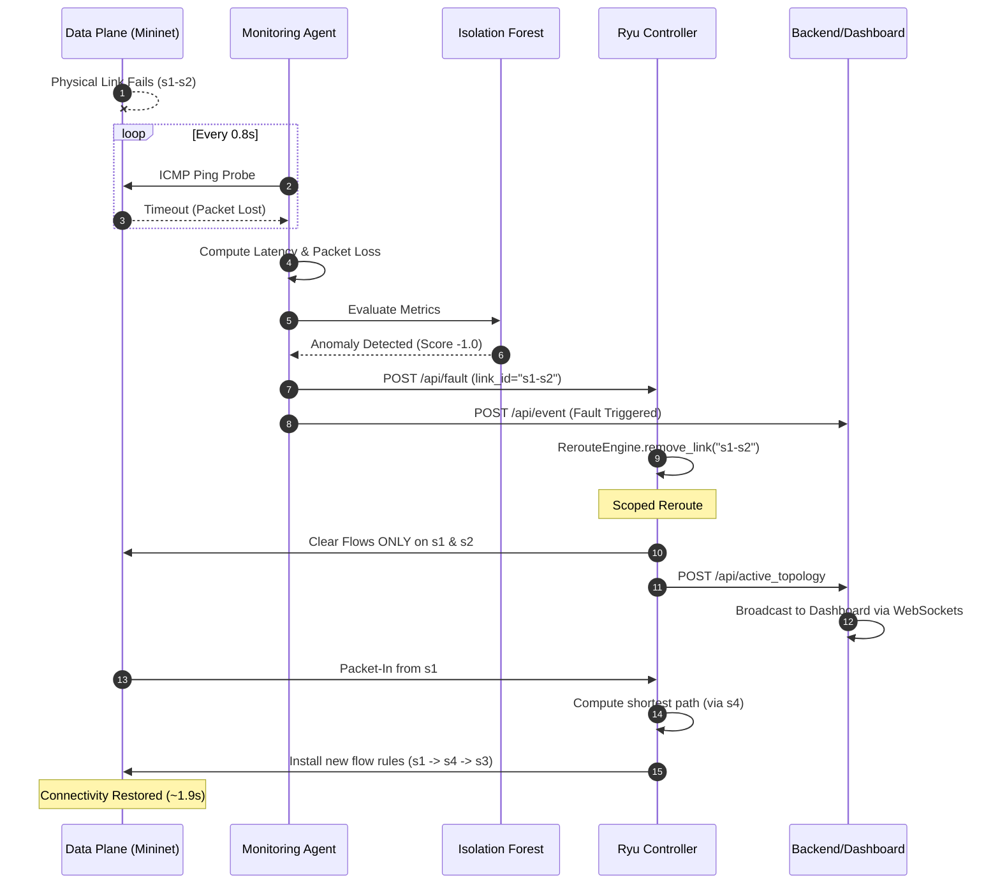

# NetworkGuardian: System Design and Architecture

NetworkGuardian is an autonomous, self-healing Software-Defined Network (SDN). It uses machine learning to actively monitor network links, detect degradation or complete failure, and dynamically recalculate paths to restore connectivity within milliseconds.

## 🏗️ High-Level Architecture

The system is composed of four primary layers:
1. **Data Plane (Mininet)**: The physical/virtual network topology comprising Open vSwitch instances and endpoints.
2. **Control Plane (Ryu)**: The SDN controller that computes paths and manages flow rules via OpenFlow 1.3.
3. **Intelligence Layer**: The distributed monitoring agents and Machine Learning anomaly detection engine.
4. **Visualization Layer**: The Flask backend and React/D3 dashboard providing real-time network telemetry.

```mermaid
graph TD
    %% Define Styles
    classDef sdn fill:#2d3748,stroke:#4fd1c5,stroke-width:2px,color:#fff
    classDef data fill:#1a202c,stroke:#a0aec0,stroke-width:2px,color:#e2e8f0
    classDef intel fill:#2b6cb0,stroke:#63b3ed,stroke-width:2px,color:#fff
    classDef viz fill:#4a5568,stroke:#f6e05e,stroke-width:2px,color:#fff

    subgraph Control Plane
        C[Ryu SDN Controller]:::sdn
        RE[Reroute Engine / Graph]:::sdn
        C <-->|Queries shortest path| RE
    end

    subgraph Data Plane
        S1((Switch 1)):::data
        S2((Switch 2)):::data
        S3((Switch 3)):::data
        S4((Switch 4)):::data
        
        H1[Host 1]:::data --- S1
        H2[Host 2]:::data --- S1
        
        S1 ===|Primary Path| S2
        S1 -.-|Backup Path| S4
        
        S2 ===|Primary Path| S3
        S4 -.-|Backup Path| S3
        
        S3 --- H3[Host 5]:::data
    end

    C <-->|OpenFlow 1.3| S1
    C <-->|OpenFlow 1.3| S2
    C <-->|OpenFlow 1.3| S3
    C <-->|OpenFlow 1.3| S4

    subgraph Intelligence Layer
        MA[Monitoring Agent]:::intel
        ML[Isolation Forest Model]:::intel
        DB[(SQLite Metrics DB)]:::intel
        
        MA -->|ICMP Ping Probes| Data Plane
        MA -->|Stores RTT/Loss| DB
        MA -->|Feeds real-time metrics| ML
    end

    subgraph Visualization Layer
        BE[Flask Backend]:::viz
        DB_Viz[(SQLite)]:::viz -.->|Reads| DB
        BE -->|Reads| DB_Viz
        FE[React & D3 Dashboard]:::viz
        
        BE <-->|WebSockets| FE
    end

    %% Fault Loop
    ML -- "Anomaly Detected (Score -1.0)" --> C
    ML -- "Fault Event" --> BE
```

## 🔄 Failure & Recovery Loop

The core feature of NetworkGuardian is its ability to autonomously heal from link failures without human intervention. The loop is executed in `< 2 seconds` end-to-end.



## 🛡️ Core Components

### 1. Ryu SDN Controller (`controller/ryu_app.py`)
- Acts as a reactive L2 learning switch.
- **Table-Miss**: Unmatched packets are forwarded to the controller.
- **L2 Learning**: Learns host MAC addresses ONLY from edge (host-facing) ports to prevent MAC flapping during redundant routing.
- **Shortest Path Forwarding**: Uses `RerouteEngine` (NetworkX graph) to dynamically calculate the shortest path between switches and install exact-match flow rules.
- **Scoped Fault Reroute**: Upon receiving a fault notification, it removes the dead edge from the graph and clears the flow tables **only on the switches directly connected to the dead link**. This forces localized spanning-tree recalculations without causing a network-wide broadcast storm.

### 2. Monitoring Agent (`monitoring/agent.py`)
- A multithreaded daemon that continuously polls all links in the topology using `mnexec` ICMP pings.
- Tracks RTT, Jitter, and Packet Loss using a rolling window (`deque`).
- Connects directly to the Anomaly Model to score the network's health in real-time.
- Enforces strict per-link cooldowns to prevent transient packet loss (during a valid reroute) from cascading into false positive fault reports on backup paths.

### 3. Anomaly Model (`detection/anomaly_model.py`)
- Uses an `IsolationForest` (Machine Learning) trained on hours of baseline network traffic.
- Detects non-linear anomalies in latency/loss patterns.
- Includes hard fallback static thresholds (e.g., >20% loss or >5ms latency) to guarantee instant triggering even if the ML model is uncertain.

### 4. Glassmorphism Dashboard (`frontend/`, `backend/`)
- A Flask/WebSocket backend that serves real-time topology and metric streams.
- The frontend uses D3.js and React-like vanilla state management to render a dark-mode, glowing, glassmorphism NOC (Network Operations Center) visualization.
- Dynamically highlights active routes in green and faulty links in red, instantly reacting to controller updates.
